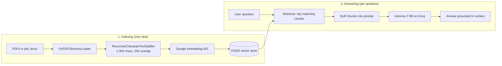

# Gemma RAG Chatbot: Q&A over PDF Documents

> A Retrieval-Augmented Generation (RAG) app that answers questions about your PDFs, grounded only in their content, using LangChain, FAISS and Google's Gemma 2 model served on Groq.

Large language models don't know what's inside your documents, and they can make up answers when asked. This app fixes that with RAG: it splits your PDFs into chunks, indexes them in a vector store, retrieves the passages most relevant to each question, and tells the model to answer **only** from that context.

<!-- Add a screenshot or demo GIF here, e.g.:

-->

---

## How It Works



1. **Load:** every PDF in `pdf_docs/` is read with LangChain's `PyPDFDirectoryLoader`.
2. **Chunk:** text is split into 1,000-character chunks with a 200-character overlap, so sentences that cross a boundary aren't lost.
3. **Embed and index:** each chunk is embedded with Google's `embedding-001` model and stored in an in-memory FAISS index.
4. **Retrieve:** for each question, the retriever finds the most similar chunks.
5. **Generate:** the chunks are inserted into a prompt that instructs the model to answer from the provided context only, and `gemma2-9b-it` on Groq writes the answer.

---

## Features

- Q&A over any set of PDFs you drop into a folder
- Answers grounded in retrieved context, which reduces hallucination
- Fast inference through Groq
- Index built once per session and reused for every question
- Simple Streamlit interface

## Tech Stack

| Component | Technology |
|-----------|------------|
| UI | Streamlit |
| Orchestration | LangChain (`create_retrieval_chain`, `create_stuff_documents_chain`) |
| Document loading | `PyPDFDirectoryLoader` (pypdf) |
| Chunking | `RecursiveCharacterTextSplitter` |
| Embeddings | Google Generative AI `embedding-001` |
| Vector store | FAISS (in memory) |
| LLM | Gemma 2 9B Instruct (`gemma2-9b-it`) via Groq |

---

## Getting Started

### 1. Prerequisites

- Python 3.10+
- A [Groq API key](https://console.groq.com/)
- A [Google AI Studio API key](https://aistudio.google.com/) for embeddings

### 2. Install

```bash
git clone https://github.com/shubham-hirani/chatbot_gemma.git
cd chatbot_gemma
python -m venv .venv
source .venv/bin/activate        # Windows: .venv\Scripts\activate
pip install -r requirements.txt
```

### 3. Set your API keys

```bash
export GROQ_API_KEY="your-groq-key"        # Windows PowerShell: $env:GROQ_API_KEY="..."
export GOOGLE_API_KEY="your-google-key"    # Windows PowerShell: $env:GOOGLE_API_KEY="..."
```

### 4. Add documents and run

Put your PDFs in `pdf_docs/` (two sample PDFs are included), then:

```bash
streamlit run main.py
```

In the browser:

1. Click **Creating vectors & Processing PDFs** to build the index.
2. Type a question in **What do you want to know?** and press Enter.

---

## Project Structure

```
chatbot_gemma/
├── main.py            # Streamlit app: indexing + retrieval chain
├── requirements.txt   # Pinned dependencies
├── pdf_docs/          # Your PDFs (sample files included)
└── README.md
```

---

## Limitations

- The FAISS index lives in memory and is rebuilt each session; it is not saved to disk.
- Click the indexing button before asking a question; otherwise there is no index to search.
- Document text is sent to Google (embeddings) and Groq (generation), so avoid confidential documents.
- Answers don't yet show which page or chunk they came from.

## Roadmap

- [ ] Show source citations (file and page) with each answer
- [ ] Persist the FAISS index to disk
- [ ] Upload PDFs from the UI instead of a folder
- [ ] Add an evaluation set and measure answer faithfulness and relevance with RAGAS
- [ ] Optional fully local mode with Ollama for private documents
- [ ] Hybrid search (BM25 + vectors) and reranking

## License

Add a license of your choice (for example, MIT).
